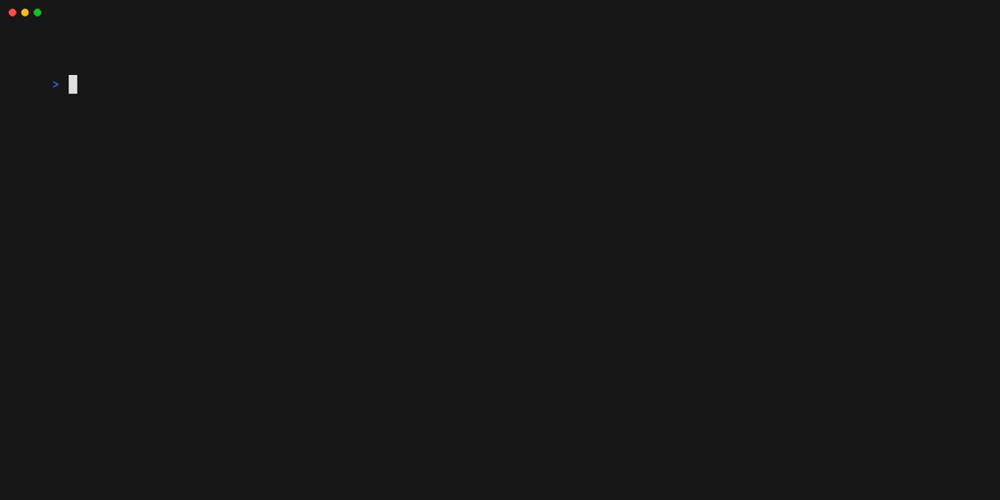

# iLEAP Go

[](https://pkg.go.dev/github.com/way-platform/ileap-go)
[](https://goreportcard.com/report/github.com/way-platform/ileap-go)
[](https://github.com/way-platform/ileap-go/actions/workflows/release.yaml)

Deploy a fully iLEAP-conformant server in minutes. Implement a standard [Connect RPC](https://connectrpc.com/) handler — the SDK handles the rest.

A Go SDK and server for logistics emissions data compatible with the [iLEAP Technical Specifications](https://sine-fdn.github.io/ileap-extension/). The server translates the iLEAP HTTP protocol (JSON envelopes, OData filtering, Link header pagination, OAuth2 error formats) into standard Connect RPC calls, so you only need to implement a typed service interface.

## SDK

### Features

* Two interfaces, two options: implement `ILeapServiceHandler` for data, `AuthHandler` for auth — done.
* `ILeapServiceHandler` is the generated Connect RPC interface. Any Connect handler implementation works out of the box.
* Go Client and Server for [PACT Product Footprints](https://wbcsd.github.io/tr/2024/data-exchange-protocol-20241024/#dt-pf) with [iLEAP extensions](https://sine-fdn.github.io/ileap-extension/#pcf-mapping).
* Go Client and Server for [iLEAP Transport Activity Data](https://sine-fdn.github.io/ileap-extension/#dt-tad).
* Uses `connect.Error` codes throughout for a single, consistent error model.

### Installing

```bash
$ go get github.com/way-platform/ileap-go@latest
```

### Using the Client

```go
client := ileap.NewClient(
    ileap.WithBaseURL(os.Getenv("BASE_URL")),
    ileap.WithOAuth2(os.Getenv("CLIENT_ID"), os.Getenv("CLIENT_SECRET")),
)

footprint, err := client.GetFootprint(context.Background(), &ileap.GetFootprintRequest{
    ID: "91715e5e-fd0b-4d1c-8fab-76290c46e6ed",
})
if err != nil {
    // Handle error.
}
fmt.Println(footprint)
```

### Using the Server

Two interfaces, two options:

```go
srv := ileap.NewServer(
    ileap.WithServiceHandler(myHandler),  // ILeapServiceHandler (generated Connect interface)
    ileap.WithAuthHandler(myAuth),        // AuthHandler
)

log.Fatal(http.ListenAndServe(":8080", srv))
```

`ILeapServiceHandler` is the generated Connect RPC interface with four methods: `ListFootprints`, `GetFootprint`, `ListTransportActivityData`, and `HandleEvent`. `AuthHandler` covers token issuance, validation, and OIDC discovery.

#### Pre-built Handlers

The `handlers/` directory provides pre-built implementations that can be plugged directly into the server:

* **`ileapdemo`**: Demo `ILeapServiceHandler` and `AuthHandler` loaded with sample data and static credentials. Ideal for testing and local development.
* **`ileapclerk`**: `AuthHandler` implementation that delegates authentication to [Clerk](https://clerk.com/) via the Clerk Frontend API.
* **`ileapconnect`**: Connect RPC client that forwards requests to an existing Connect backend. The client satisfies `ILeapServiceHandler` directly — point your iLEAP server at a Connect service and get conformance for free.

### Conformance Testing

The `ileaptest` package exports a reusable conformance test suite that any iLEAP server implementer can run:

```go
import "github.com/way-platform/ileap-go/ileaptest"

func TestMyILeapServer(t *testing.T) {
    srv := startMyServer(t)
    ileaptest.RunConformanceTests(t, ileaptest.ConformanceTestConfig{
        ServerURL: srv.URL,
        Username:  "admin",
        Password:  "secret",
    })
}
```

Run against a remote server:

```bash
$ ILEAP_SERVER_URL=https://demo.ileap.way.cloud ILEAP_USERNAME=hello ILEAP_PASSWORD=pathfinder \
    go test -v ./ileaptest/...
```

### Developing

#### Build project

The project is built using [Mage](https://magefile.org). See [magefile.go](./magefile.go).

```bash
$ ./tools/mage build
```

For all available build tasks, see:

```bash
$ ./tools/mage
```

## CLI tool



### Installing

```bash
$ go install github.com/way-platform/ileap-go/cmd/ileap@latest
```

Prebuilt binaries for Linux, Windows, and Mac are available from the [Releases](https://github.com/way-platform/ileap-go/releases).

### Using

Start a local demo server in the background:

```bash
$ ileap demo-server --port 8080 &
INFO iLEAP demo server listening address=:8080
```

Log in to the local demo server:

```bash
$ ileap auth login \
  --base-url http://localhost:8080 \
  --client-id hello \
  --client-secret pathfinder

Logged in to http://localhost:8080.
```

Fetch a product footprint:

```bash
$ ileap footprint 91715e5e-fd0b-4d1c-8fab-76290c46e6ed
{
  "companyName": "My Corp",
  "created": "2022-03-01T09:32:20Z",
  "id": "91715e5e-fd0b-4d1c-8fab-76290c46e6ed",
  "organizationName": "My Corp",
  "pcf": {
    "biogenicCarbonContent": "0.41",
    "fossilGhgEmissions": "1.5",
    "pCfExcludingBiogenic": "1.63",
    "pCfIncludingBiogenic": "1.85",
    "unitaryProductAmount": "1"
  },
  "productDescription": "Bio-Ethanol 98%, corn feedstock (bulk - no packaging)",
  "specVersion": "2.0.0",
  "status": "Active"
}
```
